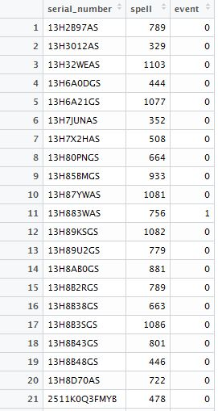
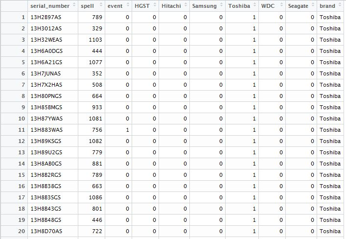
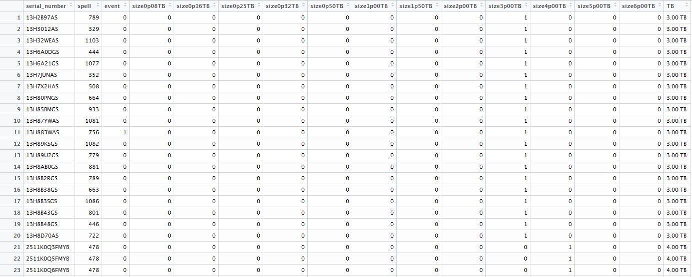

```{r setup, include=FALSE}
knitr::opts_chunk$set(echo = TRUE)
```

#Introduction
Hard drive reliability details are important not only for data centers to provide high uptime service, but also to hard drive manufacturer to ensure the production of high quality hard drives to support the competitive and growing business. The project aims at analyzing the trends of the survival period of hard drives of variety of hard drives available in the market. These trends along with some physical data, its major causes that results in hard drive failures can possibly be deduced.

##Value
The project will explore and analyze the trends in hard drive failures. Three major areas that can benefit these analysis are:

1. The hard drive manufacturers can use such information to focus on improving the key weaknesses.
2. The data centers can also use the information to predict the risk and decide which types of hard drives they should choose to run data centers to ensure high uptime and low customer dissatisfaction.
3. The consumers can also use such data to make decision on which types of hard drives they should be purchasing to backup their valuable files and reducing the risk of losing them.

##Hard Drive Failures
There are two types of hard drive failures:

* Predictable failures: resulting from slow processes such as mechanical wear and gradual degradation of storage surfaces. Monitoring can determine when such failures are becoming more likely.
* Unpredictable failures: happening without warning and ranging from electronic components becoming defective to a sudden mechanical failure (which may be related to improper handling).

##Goals
The main goals of the projects are:

* Understanding the failure rates of the hard drives based on its different manufacturer, models, and sizes. These may lead to the list of "high risk" hard drives that may be avoided for critical operations.
* Estimate and predict the survival rates of the hard drives based on its different manufacturer and sizes. The data center can then proactively plan for the hard drive procurement and replacement to minimize inventory and maximize uptime.

#Data
[Backblaze](https://www.backblaze.com/) is an online personal/business backup and cloud storage service provider, which consumes about 1000 hard drive per month. The company wrote scripts to track the hard drive health information since 2013. See more information [here](https://www.backblaze.com/blog/hard-drive-data-feb2015/). The dataset is made open-source [here](https://www.backblaze.com/b2/hard-drive-test-data.html).

The data contains key properties of the hard drives (serial number, manufacturer/model and capacity), whether or not it failed, and 80 to 90 [SMART (Self-Monitoring, Analysis and Reporting Technology)](https://en.wikipedia.org/wiki/S.M.A.R.T.) parameters (or 40 to 45 normalized values). This can leads to failure mode identification.

More specifically:

* Date - The date of the file in yyyy-mm-dd.csv format.
* Serial Number - The manufacturer-assigned serial number of the drive.
* Model - The manufacturer-assigned model number of the drive.
* Capacity - The drive capacity in bytes.
* Failure - Contains a "0" if the drive is OK. Contains a "1" if this is the last day the drive was operational before failing.
* 2013-2014 SMART Stats - 80 columns of data, that are the Raw and Normalized values for 40 different SMART stats as reported by the given drive. Each value is the number reported by the drive.
* 2015-2016 SMART Stats - 90 columns of data, that are the Raw and Normalized values for 45 different SMART stats as reported by the given drive. Each value is the number reported by the drive.

##Data Organization
The data is organized into directories of different time period. For instance, the data available in 2013 is named data_2013. Each folder contains csv file of the hard drive details on the shelf on each day. The file names are organized in the format of yyyy-mm-dd.csv.

In each of the csv file, each row of data is the details of each hard drive that is operational on the shelf each day. It is identified by the serial numbers of the individual hard drives. The model and capacity of the hard drive is reported. If the hard drive is failed on the particular day, it is labeled 1 in the failure column; otherwise it is labeled 0. The row with the failed hard drive will be removed in the csv file of the next day, and, potentially a new hard drive will be added. The SMART data of each of the hard drive is also reported in columns. 

##Data Import
Due to large amount of data logged in the dataset, we can only import certain key columns in the data to perform various functions. We found that RStudio was unable to import and create a data frame of larger than 90 files, since it will be larger than the memory that can hold the data (about 8 GB RAM). Hence, as the first step, we will look into only the date, serial number, model number, capacity and if the harddrive failed, and ignore the SMART data. We believe that by looking at the above data, we can deduce some failure conclusion.

It is impossible to import all the available data into a huge data frame to perform analysis. This is even impossible for just a year of data (the author spent quite some times to make the attempts but failed due to the limited available memory). Also, importing the data also takes significant amount of time. Hence, the approach adopted here is to write a script to explicitly import the data into RStudio, then save them to the RData file. Then the RData files will be loaded to perform the corresponding analysis.

The "dplyr" package is used extensively to write the scripts such that it extracts only the required columns of data and/or calculating the statistics required to perform the corresponding plotting and/or analysis. They are well documented in the scripts. Also, the scripts are first tested on a small manageable set of csv files, i.e. only 15 days of csv data in a folder, then extended to the full "production" to take the full year of data. 

While this project is not utilizing the SMART data, the author suggests in the later stage if SMART data study is involved, good strategy during the data import stage will be required. It will need to import only relevant information (or just enough details) for study as the data size can quickly grows in size. Some of the information may need to be processed as soon as a csv file is imported to build the data frame. For instance, if one of the SMART data is required to study with respect to brand, the serial number may not need to be imported, and the model number may need to be converted immediately to brand, and the model number is then disgarded since the model numbers are strings that can take up much of the data size. Then the failure data and the corresponding SMART data of interest will be imported.

One of the validations that we will need to do is to ensure that there is no duplicated serial numbers in each row of the observation. This simple check can be done by counting the distinct number of serial numbers of each csv, and see if it is equal to the number of rows.

##Data Analysis
As of the writing of this report, here are the details of all the data available:

Directory | Data Available | Total Data Size | Each File Size | Number of Drives on Shelf (from first day to last day in the directory)
----------|----------------|-----------------|----------------|--------------------------
data_2013 | 266 days (starting 2013-04-10) | 738 MB | 3 - 4 MB | 21,195 - 27,223
data_2014 | 365 days | 2.81 GB | 7 - 10 MB | 27,223 - 41,213
data_2015 | 365 days | 4.19 GB | 10 - 14 MB | 41,213 - 57,544
data_Q1_2016 | 91 days | 1.32 GB | 14 - 15 MB | 57545 - 62,952
data_Q2_2016 | 91 days | 1.44 GB | 15 - 18 MB | 62,952 - 70,403

As can be seen, the data involved is huge. We first perform some data exploration by looking at the number of hard drives on the shelf over time. Subsequently, we also look at the number of hard drives of each brand and size on the shelf over time.

###Number of Hard Drives Over Time
As mentioned previously, only the required data is calculated to create the RData files. In this case, the number of drives of each day and the number of failures are extracted and created a new data frame of only date, number of drives (number of rows) and number of failures (sum of number of 1's in failure columns). Here are the results:

####Year 2013 (from 2013-04-10 to 2013-12-31):
```{r}
library(ggplot2)
load(file = "C:/Users/Chinpei/Documents/R/HardDriveReliability/data_2013/2013/hd2013_totalDriveCnt_FailureCnt.RData")
ggplot(stat_totalDriveCnt_FailureCnt_df, aes(x = date_col, y = numDrive, colour = numFailed)) + 
  geom_line(size = 3) +
  scale_x_date("Date") +
  scale_y_continuous("Number of Drives")
```

####Year 2014 (from 2014-01-01 to 2014-12-31):
```{r}
library(ggplot2)
load(file = "C:/Users/Chinpei/Documents/R/HardDriveReliability/data_2014/2014/hd2014_totalDriveCnt_FailureCnt.RData")
ggplot(stat_totalDriveCnt_FailureCnt_df, aes(x = date_col, y = numDrive, colour = numFailed)) + 
  geom_line(size = 3) +
  scale_x_date("Date") +
  scale_y_continuous("Number of Drives")
```

####Year 2015 (from 2015-01-01 to 2015-12-31):
```{r}
library(ggplot2)
load(file = "C:/Users/Chinpei/Documents/R/HardDriveReliability/data_2015/2015/hd2015_totalDriveCnt_FailureCnt.RData")
ggplot(stat_totalDriveCnt_FailureCnt_df, aes(x = date_col, y = numDrive, colour = numFailed)) + 
  geom_line(size = 3) +
  scale_x_date("Date") +
  scale_y_continuous("Number of Drives")
```

####Q1 of Year 2016 (from 2016-01-01 to 2016-03-31):
```{r}
library(ggplot2)
load(file = "C:/Users/Chinpei/Documents/R/HardDriveReliability/data_Q1_2016/data_Q1_2016/hdQ1_2016_totalDriveCnt_FailureCnt.RData")
ggplot(stat_totalDriveCnt_FailureCnt_df, aes(x = date_col, y = numDrive, colour = numFailed)) + 
  geom_line(size = 3) +
  scale_x_date("Date") +
  scale_y_continuous("Number of Drives")
```

####Q2 of Year 2016 (from 2016-04-01 to 2016-06-30):
```{r}
library(ggplot2)
load(file = "C:/Users/Chinpei/Documents/R/HardDriveReliability/data_Q2_2016/data_Q2_2016/hdQ2_2016_totalDriveCnt_FailureCnt.RData")
ggplot(stat_totalDriveCnt_FailureCnt_df, aes(x = date_col, y = numDrive, colour = numFailed)) + 
  geom_line(size = 3) +
  scale_x_date("Date") +
  scale_y_continuous("Number of Drives")
```

As can be noted from the above graphs, the data logged is not without issue. There are a few files logged 0 kb, which means that there was no data on those particular days. There are files also have sudden drop of the number of hard drives (some hard drives details are not logged), which may be due to the logging issue on those days. Fortunately this is not imposing a huge issue since the sampling is assumed to be in a day, and we may just lose the data of some of the subjects (data is "censored" from the survival analysis point of view).

###Number of Hard Drives of Different Brand/Manufacturer Over Time
It is also interesting to see the number of different brand/manufacturer of the drives being consumed. We use grep function to identify the following expressions in model to assign to a new column brand:

* "HGST"" -> "HGST"
* "Hitachi" -> "Hitachi"
* "SAMSUNG" -> "Samsung"
* "TOSHIBA" -> "Toshiba"
* "WDC" -> "Western Digital"
* "^ST" -> "Seagate"

The only tricky part is all Seagate hard drive has prefix "ST", while "ST" is part of "HGST" that requires special distinction. Fortunately in "HGST" hard drives, "ST" won't be prefixes.

####Year 2013 (from 2013-04-10 to 2013-12-31):
```{r}
library(ggplot2)
load(file = "C:/Users/Chinpei/Documents/R/HardDriveReliability/data_2013/2013/hd2013_brandDriveCnt_FailureCnt.RData")
ggplot(stat_brandDriveCnt_FailureCnt_df, aes(x = date, y = total)) + 
  geom_line(aes (color = brand), size = 1.25) +
  scale_x_date("Date") +
  scale_y_continuous("Number of Drives")
```

####Year 2014 (from 2014-01-01 to 2014-12-31):
```{r}
library(ggplot2)
load(file = "C:/Users/Chinpei/Documents/R/HardDriveReliability/data_2014/2014/hd2014_brandDriveCnt_FailureCnt.RData")
ggplot(stat_brandDriveCnt_FailureCnt_df, aes(x = date, y = total)) + 
  geom_line(aes (color = brand), size = 1.25) +
  scale_x_date("Date") +
  scale_y_continuous("Number of Drives")
```

####Year 2015 (from 2015-01-01 to 2015-12-31):
```{r}
library(ggplot2)
load(file = "C:/Users/Chinpei/Documents/R/HardDriveReliability/data_2015/2015/hd2015_brandDriveCnt_FailureCnt.RData")
ggplot(stat_brandDriveCnt_FailureCnt_df, aes(x = date, y = total)) + 
  geom_line(aes (color = brand), size = 1.25) +
  scale_x_date("Date") +
  scale_y_continuous("Number of Drives")
```

####Q1 of Year 2016 (from 2016-01-01 to 2016-03-31):
```{r}
library(ggplot2)
load(file = "C:/Users/Chinpei/Documents/R/HardDriveReliability/data_Q1_2016/data_Q1_2016/hdQ1_2016_brandDriveCnt_FailureCnt.RData")
ggplot(stat_brandDriveCnt_FailureCnt_df, aes(x = date, y = total)) + 
  geom_line(aes (color = brand), size = 1.25) +
  scale_x_date("Date") +
  scale_y_continuous("Number of Drives")
```

####Q2 of Year 2016 (from 2016-04-01 to 2016-06-30):
```{r}
library(ggplot2)
load(file = "C:/Users/Chinpei/Documents/R/HardDriveReliability/data_Q2_2016/data_Q2_2016/hdQ2_2016_brandDriveCnt_FailureCnt.RData")
ggplot(stat_brandDriveCnt_FailureCnt_df, aes(x = date, y = total)) + 
  geom_line(aes (color = brand), size = 1.25) +
  scale_x_date("Date") +
  scale_y_continuous("Number of Drives")
```

One can see that Backblaze does favor some brands. In 2013, Hitachi and Seagate were mainly used. Then we saw increased installation of Seagate over time, and became the majority of them on the shelf. We also saw some increased installation of HGST hard drives in 2014. The rest of the brands were not changed much.

###Number of Hard Drives of Different Capacity Over Time

####Year 2013 (from 2013-04-10 to 2013-12-31):
```{r}
library(ggplot2)
load(file = "C:/Users/Chinpei/Documents/R/HardDriveReliability/data_2013/2013/hd2013_sizeDriveCnt_FailureCnt.RData")
ggplot(stat_sizeDriveCnt_FailureCnt_df, aes(x = date, y = total)) + 
  geom_line(aes (color = as.factor(size)), size = 1.25) +
  scale_x_date("Date") +
  scale_y_continuous("Number of Drives")
```

####Year 2014 (from 2014-01-01 to 2014-12-31):
```{r}
library(ggplot2)
load(file = "C:/Users/Chinpei/Documents/R/HardDriveReliability/data_2014/2014/hd2014_sizeDriveCnt_FailureCnt.RData")
ggplot(stat_sizeDriveCnt_FailureCnt_df, aes(x = date, y = total)) + 
  geom_line(aes (color = as.factor(size)), size = 1.25) +
  scale_x_date("Date") +
  scale_y_continuous("Number of Drives")
```

####Year 2015 (from 2015-01-01 to 2015-12-31):
```{r}
library(ggplot2)
load(file = "C:/Users/Chinpei/Documents/R/HardDriveReliability/data_2015/2015/hd2015_sizeDriveCnt_FailureCnt.RData")
ggplot(stat_sizeDriveCnt_FailureCnt_df, aes(x = date, y = total)) + 
  geom_line(aes (color = as.factor(size)), size = 1.25) +
  scale_x_date("Date") +
  scale_y_continuous("Number of Drives")
```

####Q1 of Year 2016 (from 2016-01-01 to 2016-03-31):
```{r}
library(ggplot2)
load(file = "C:/Users/Chinpei/Documents/R/HardDriveReliability/data_Q1_2016/data_Q1_2016/hdQ1_2016_sizeDriveCnt_FailureCnt.RData")
ggplot(stat_sizeDriveCnt_FailureCnt_df, aes(x = date, y = total)) + 
  geom_line(aes (color = as.factor(size)), size = 1.25) +
  scale_x_date("Date") +
  scale_y_continuous("Number of Drives")
```

####Q2 of Year 2016 (from 2016-04-01 to 2016-06-30):
```{r}
library(ggplot2)
load(file = "C:/Users/Chinpei/Documents/R/HardDriveReliability/data_Q2_2016/data_Q2_2016/hdQ2_2016_sizeDriveCnt_FailureCnt.RData")
ggplot(stat_sizeDriveCnt_FailureCnt_df, aes(x = date, y = total)) + 
  geom_line(aes (color = as.factor(size)), size = 1.25) +
  scale_x_date("Date") +
  scale_y_continuous("Number of Drives")
```

Similarly, we can see that the 3 GB drives are mainly used in 2013, then the steady increased installation of 4 GB drives over the years.

#Hard Drive Reliability Performance

##Survival Analysis
The suitable analysis to be studied on the data is the survival analysis. [Survival analysis](https://en.wikipedia.org/wiki/Survival_analysis) is to analyze the expected duration of time until an event occurs. R has a package ["survival"](https://cran.r-project.org/web/packages/survival/survival.pdf) to perform the analysis. There are some good resources on survival analysis:

* **Econometrics videos and notes by Ani Katchova**: Very accessible videos to walk through the fundamentals and examples using R. [https://sites.google.com/site/econometricsacademy/econometrics-models/survival-analysis](https://sites.google.com/site/econometricsacademy/econometrics-models/survival-analysis)
* **David Madigan Notes from Columbia University**: More in-depth explanation with R examples. [http://www.stat.columbia.edu/~madigan/W2025/notes/survival.pdf](http://www.stat.columbia.edu/~madigan/W2025/notes/survival.pdf)
* **"Survival Analysis - A Self-Learning Text, 3rd Edition" Book**: Springer textbook by David G. Kleinbaum and Mitchel Klein. [http://www.springer.com/us/book/9781441966452](http://www.springer.com/us/book/9781441966452)

The key of the survival analysis is the following concept. Suppose the probability that the duration time of less than $t$ is $F(t) = Prob(T \leq t) = \int_0^t f(s) ds$, then the *survival function* is the probability that the duration of at least $t$ as $S(t) = 1 - F(t) = Prob(T \geq t)$. *Hazard rate* is defined as the probability that the duration will end after time $t$ given that it has lasted until time $t$ as $\lambda(t) = \frac{f(t)}{S(t)}$. The hazard rate is the probability that a subject experiences the event at time $t$ while that subject is at risk for experiencing that event.

In the case of hard drive, our interest is to understand the expected duration of the hard drive can "survive" on the shelf before it fails. This is important since the datacenter like BackBlaze can: (a) favorbly procure the hard drives that have high "survival" period, (b) optimize the time for procuring the replacement, i.e. not procuring too early to store too much inventory, or too late that affect the uptime.

##Survival Models
This section provides very high level description of survival model analysis. Please consult the references in the previous subsection for more information.

Generally, the survival function is decreasing over time. There are three types of models to model such survival functions and the corresponding hazard rate: (a) non-parametric models, (b) parametric models, and (c) semi-parametric.

The **non-parametric models** involves arranging the durations of the observations from smallest to largest, then calculate the corresponding *survival function* and *hazard rate* for each duration. The Kaplan-Meier calculation can be plotted on a graph to see the decrease of survival function over the duration. Then the Nelson-Aalen calculation can be used to calculate the corresponding hazard rate. See the above references for details.

The **parametric models** are mainly just fit them in different models. The popular ones are *exponential*, *Weibull*, *Gompertz* and *log-logistics*. In advantages of these are the performance can be compared using parametric values. In this project, we will not focus on this method as the interpretation of the parameters can be highly dependent on the model used. We think that the nonparametric models are more visual.

The **semiparametric** Cox proportional hazard model is also another more intuitive (and less ambiguous) method of evaluating the hazard rate. While details can also be found in the above references, mainly the determined coefficients can be interpreted as follows:

* Positive coefficient means hazard rate of $>1$, which means that it has lower duration and higher hazard rate (more likely for the event to happen).
* Negative coefficient means hazard rate of between 0 and 1, which means that it has higher duration and lower hazard rate (less likely for the event to happen).

We will adopt the following to study the hard drive reliability performance:

* **Kaplan-Meier** survival function: survfit(Surv(spell, event) ~ group)
* **Nelson-Aalen** hazard function: survfit(coxph(Surv(spell, event) ~ group), type = "aalen")
* **Cox proportional** hazard function: coxph(Surv(spell, event) ~ groups, method = "breslow")

For our analysis, a few covariates/groups (basically properties that affect the survival) can be looked into. First is more on the hard drive physical properties itself like manufacturer (brand) and capacity. The reason why this is physical is that it is something that doesn't change over time.

For future work, we can explore the properties changed over time (time series data) such as using the SMART data. This is more difficult since typically covariates are discrete variables, while SMART data are time series integers.

##Data Wrangling/Manipulation
In order to perform survival analysis, the data needs to be coverted such that they can be suitable for the analysis. The serial number is an important element of the hard drive, which serves as the identifier of the "subjects" to be studied. Since each subject's situation is spreaded across the csv files, all these rows of data with appropriately picked/computed/grepped columns will need to be binded to create a large data frame. Then, the serial numbers can be grouped (using "group_by" in "dplyr"), then calculate the corresponding "spell", "event" and "group" or "groups" (using "summarise" in "dplyr"). Finally, these "summarised" data will need to be joined column-wise (using "left_join" in "dplyr") to create the format to be used with the survival function.

As discussed, we will look into:

1. Overall survival of the hard drives in Backblaze server: take only serial number and failure binary columns, and bind all the data in rows for each day over the whole duration. For example:



2. The survival/hazard based on different brands/manufacturer: take model info and use grep to create brand columns of TRUE and FALSE, delete the model info to save file size, then combine to serial number and failure binary columns. The resulting columns will be "serial number (character)" - "failure (binary)" - "HGST (binary)" - "Hitachi (binary)" - "Samsung (binary)" - "Toshiba (binary)" - "WDC (binary)" - "Seagate (binary)". Again, bind all the data in rows for each day over the whole duration. For example:



3. The survival/hazard based on different sizes/capacity: take the capacity info and create the binary details of each of them (like the brand details above), then combine them with serial number and failure binary columns. For example:



#Hard Drive Reliability Performance Results

##Overall Survival of Hard Drives

```{r}
library(survival)
load(file = "C:/Users/Chinpei/Documents/R/HardDriveReliability/SurvivalAnalysisData/allSurvival.RData")

# Kaplan-Meier non-parametric analysis
kmsurvival <- survfit(Surv(allSurvival$spell, allSurvival$event) ~ 1)
str(kmsurvival)
plot(kmsurvival, lwd = 2.0, xlab = "Days", ylab = "Survival Probability")
title("Kaplan-Meier - Overall")

# Nelson-Aalen non-parametric analysis
nasurvival <- survfit(coxph(Surv(allSurvival$spell, allSurvival$event) ~ 1), type = "aalen")
#summary(nasurvival)
plot(nasurvival, lwd = 2.0, xlab = "Days", ylab = "Survival Probability")
title("Nelson-Aalen - Overall")

# Cox proportional hazard model - coefficients and hazard rates
coxph <- coxph(Surv(allSurvival$spell, allSurvival$event) ~ 1, method = "breslow")
summary(coxph)
```

##Survival based on Different Brand/Manufacturer
```{r}
library(survival)
load(file = "C:/Users/Chinpei/Documents/R/HardDriveReliability/SurvivalAnalysisData/allBrandSurvival.RData")

# Kaplan-Meier non-parametric analysis
kmsurvival <- survfit(Surv(allBrandSurvival$spell, allBrandSurvival$event) ~ allBrandSurvival$brand)
#summary(kmsurvival)
plot(kmsurvival, col = c(1:6), lwd = 2.0, xlab = "Days", ylab = "Survival Probability")
legend("bottom", c("HGST", "Hitachi", "Samsung", "Toshiba", "WDC", "Seagate"), col = c(1:6), lwd = 2.0)
title("Kaplan-Meier - Different Brand/Manufacturer")

# Nelson-Aalen non-parametric analysis
nasurvival <- survfit(coxph(Surv(allBrandSurvival$spell, allBrandSurvival$event) ~ allBrandSurvival$brand), type = "aalen")
#summary(nasurvival)
plot(nasurvival, col = c(1:6), lwd = 2.0, xlab = "Days", ylab = "Survival Probability")
legend("bottom", c("HGST", "Hitachi", "Samsung", "Toshiba", "WDC", "Seagate"), col = c(1:6), lwd = 2.0)
title("Nelson-Aalen - Different Brand/Manufacturer")

# Cox proportional hazard model - coefficients and hazard rates
coxph <- coxph(Surv(allBrandSurvival$spell, allBrandSurvival$event) ~ allBrandSurvival$brand, method = "breslow")
summary(coxph)
```

##Survival based on Different Size/Capacity
```{r}
library(survival)
load(file = "C:/Users/Chinpei/Documents/R/HardDriveReliability/SurvivalAnalysisData/allSizeSurvival.RData")

# Kaplan-Meier non-parametric analysis
kmsurvival <- survfit(Surv(allSizeSurvival$spell, allSizeSurvival$event) ~ allSizeSurvival$TB)
#summary(kmsurvival)
plot(kmsurvival, col = c(1:12), lwd = 2.0, xlab = "Days", ylab = "Survival Probability")
legend("bottomleft", c("0.08 TB", "0.16 TB", "0.25 TB", "0.32 TB", "0.50 TB", "1.00 TB", "1.50 TB", "2.00 TB", "3.00 TB", "4.00 TB", "5.00 TB", "6.00 TB"), col = c(1:12), lwd = 2.0)
title("Kaplan-Meier - Different Size/Capacity")

# Nelson-Aalen non-parametric analysis
nasurvival <- survfit(coxph(Surv(allSizeSurvival$spell, allSizeSurvival$event) ~ allSizeSurvival$TB), type = "aalen")
#summary(nasurvival)
plot(nasurvival, col = c(1:12), lwd = 2.0, xlab = "Days", ylab = "Survival Probability")
legend("bottomleft", c("0.08 TB", "0.16 TB", "0.25 TB", "0.32 TB", "0.50 TB", "1.00 TB", "1.50 TB", "2.00 TB", "3.00 TB", "4.00 TB", "5.00 TB", "6.00 TB"), col = c(1:12), lwd = 2.0)
title("Nelson-Aalen - Different Size/Capacity")

# Cox proportional hazard model - coefficients and hazard rates
coxph <- coxph(Surv(allSizeSurvival$spell, allSizeSurvival$event) ~ allSizeSurvival$TB, method = "breslow")
summary(coxph)
```

#Conclusion

##Future Work
